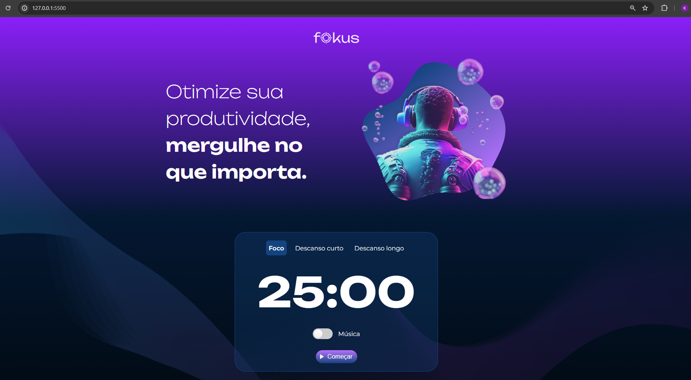

<h1 align="center"> Projeto Fokus</h1>

Neste projeto desenvolvi um sistema Pomodoro em JavaScript com foco na manipulação do DOM, que faz parte da Formação Front-End Alura.❤️ 

  <a href="#-tecnologias">Tecnologias</a>&nbsp;&nbsp;&nbsp;|&nbsp;&nbsp;&nbsp;
  <a href="#-projeto">Projeto</a>&nbsp;&nbsp;&nbsp;

  

 

  

    
    </a>
  

 
 

 

## 🚀 Tecnologias

Esse projeto está sendo desenvolvido com as seguintes tecnologias:

<li> HTML
<li> CSS
<li> JavaScript
<li> GitHub

## 💻 Projeto

"Alura Fokus". 

Um sistema para auxiliar no monitoramento dos estudos, utilizando a metodologia pomodoro.  
Contendo 3 opções: Foco, Descanso Curto e Descanso Longo.  
E música relaxante.
